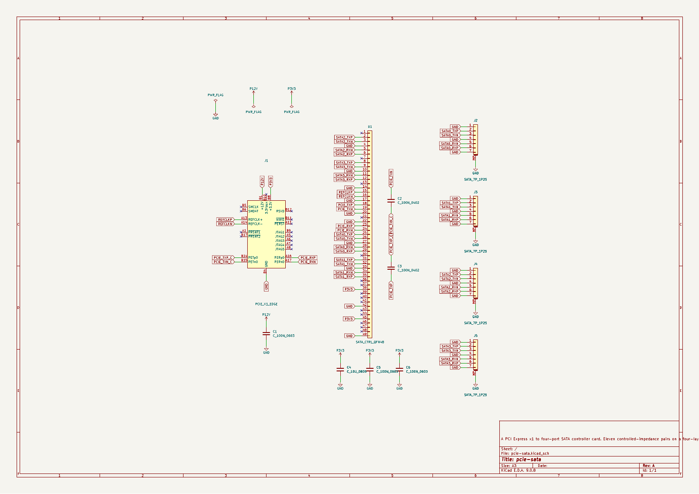
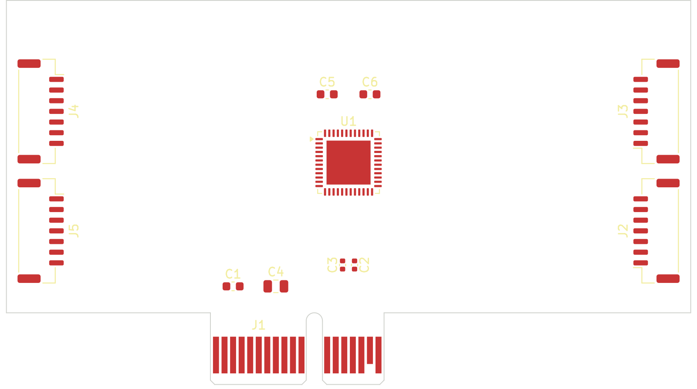
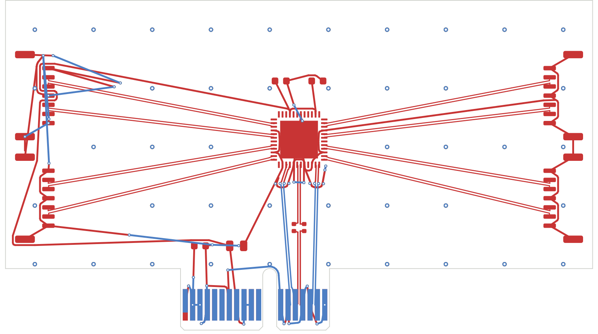
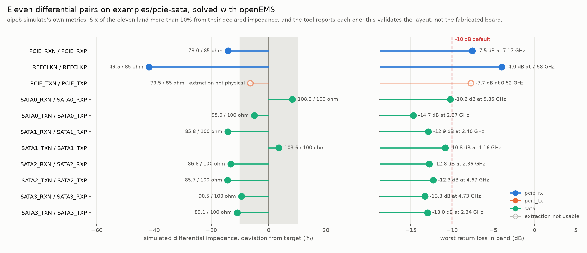
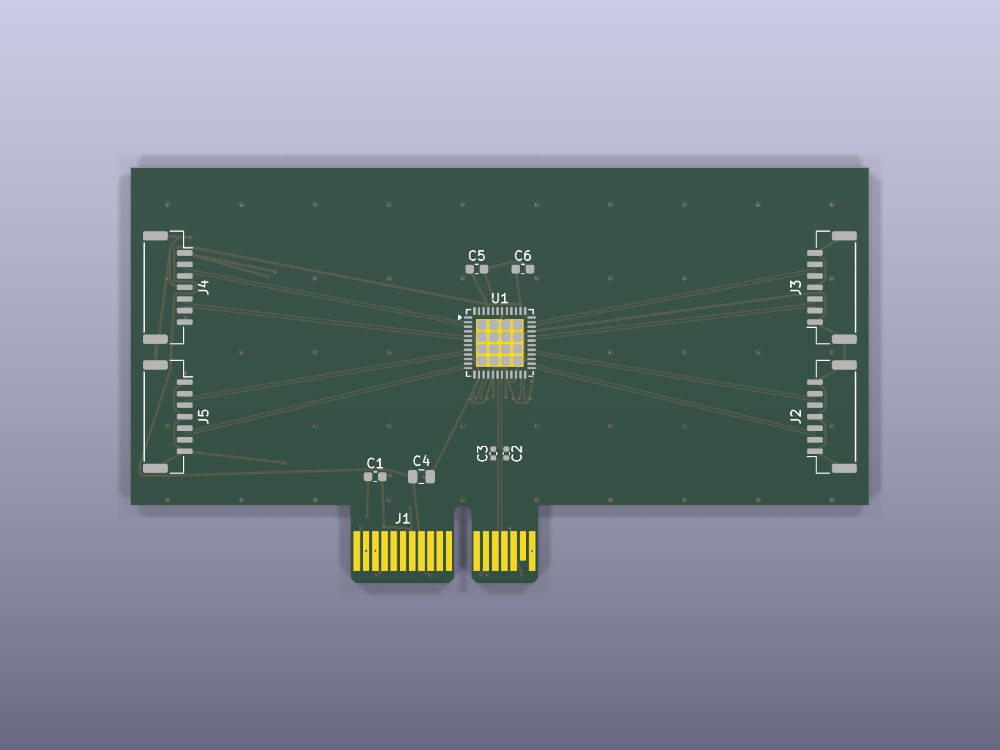

# aipcb

**A circuit board described as intent, compiled to KiCad.**

You write what the circuit *is* — in YAML. `aipcb` compiles it into real KiCad
schematics and boards, places, routes, pours, runs KiCad's own ERC and DRC against
the result, and can hand each differential pair to a field solver. Every problem
comes back pointing at the line of source that caused it. The KiCad files are build
output — but you can still open them, and your edits survive the next build.

## Source to fabrication, in six steps

All of it is `examples/pcie-sata`, bundled here: a PCI Express x1 card carrying a
four-port SATA controller, eleven controlled-impedance pairs on four layers. Every
image is generated from it by [`tools/make_images.py`](tools/make_images.py).

### 1. Declare intent, not geometry

The width is *derived* from the impedance and the stackup. You do not compute it,
and you cannot silently get it wrong:

```yaml
net_classes:
  pcie_tx:
    impedance_diff_ohm: 85    # the requirement; the trace width follows
    diff_pair_gap_mm: 0.15    # a manufacturing choice, so an input
    max_skew_mm: 0.127        # PCIe CEM r3.0 §4.7.7, for an add-in card
    reference: In1.Cu         # the plane the return current uses
```

### 2. It compiles to a schematic

`aipcb build --render` — drawn by convention from what the source already knows:
what serves what, which rails go up, which grounds go down.



### 3. Parts are placed

Mechanically-fixed parts anchor the board; everything else is placed relative to
what it serves. The outline is a shape you declare, and here it is checked against
the card-edge footprint's own `Edge.Cuts` geometry rather than being drawn twice.



### 4. And routed

A topological router, negotiating congestion across four layers. Coupled pairs are
routed as one object — through the AC-coupling capacitors, across layer changes, at
the width their impedance target derived.



### 5. The pairs are simulated

`aipcb simulate` slices each pair out of the routed board with its reference plane,
meshes it, and runs openEMS. Out come impedance, return loss and insertion loss,
as source-referenced findings like everything else.



This is the honest version of that picture: **six of the eleven pairs come back
more than 10% away from the impedance they declared**, and one extraction is not
physical and is reported as unusable rather than plotted as a result. That is the
step doing its job. The closed-form width derivation says one thing; the field
solver disagrees, and you get told by how much.

### 6. And exported for fabrication

`aipcb export` writes Gerbers, drill files, a BOM and a placement file. KiCad
renders the same board:



---

## You do the layout, if you want

**Routing is one step, it is declared in the source, and you can take it back.**
Validation, placement, pours, ERC, DRC, the high-speed checks, simulation and
fabrication output all work identically in every mode below.

| Mode | You do | aipcb does |
|---|---|---|
| **Full auto** | nothing | places, routes, pours, checks |
| **Hybrid** | draw the nets you care about, in KiCad | routes everything else *around* your copper, never through it, and checks all of it identically |
| **Fully manual** | all the copper | schematic, placement, pours, ERC/DRC, high-speed checks, export |

Hybrid is the one most people want. Mark a net or a whole class as yours:

```yaml
nets:
  PCIE_TXP: { class: pcie_tx, routing: manual }   # this one is mine
```

`aipcb check --json` then reports every net as `manual-routed`, `manual-pending`,
`auto-routed` or `handed-over`. `manual-pending` is the one that matters: a board
whose critical pairs are declared-and-not-yet-drawn looks finished to anything
counting unrouted connections, and this says so by name.

If you would rather a different autorouter did the work, `aipcb export --dsn`
writes Specctra DSN with all existing copper marked fixed, and `aipcb import --ses`
splices the result back and verifies it against your net classes —
[Freerouting, headlessly](docs/external-routers.md).

---

## Quickstart

Python 3.12+ and **KiCad 9**. KiCad is the backend, not an optional extra:
compiling a design reads its stock symbol and footprint libraries, and checking,
rendering and exporting shell out to `kicad-cli`. `aipcb validate`, `summary`,
`query` and `schema` are the commands that run on their own.

```bash
git clone https://github.com/mikkelmi2/aipcb && cd aipcb
python3 -m venv .venv && .venv/bin/pip install -e .
.venv/bin/aipcb validate examples/usb-port/design.yaml
```

Install is about 7 seconds on a warm pip cache; there is nothing to compile.

```
ok: no problems found
usb-port rev A: 7 components, 7 nets, 20 connections
```

Now build it and open the result in KiCad:

```bash
.venv/bin/aipcb build examples/usb-port/design.yaml
kicad examples/usb-port/usb-port.kicad_pro
```

Then break it on purpose — change `diff_pair: USB_DP` to `USB_DPP` under
`nets: USB_DM:` — and validate again. You get located, coded diagnostics instead of
a stack trace, which is what makes the loop work:

```
examples/usb-port/design.yaml:53:3: error[asymmetric-diff-pair]: net 'USB_DP'
names 'USB_DM' as its differential partner, but 'USB_DM' names USB_DPP
  at: nets.USB_DM.diff_pair
  hint: set `diff_pair: USB_DP` on 'USB_DM'
examples/usb-port/design.yaml:53:3: error[unknown-diff-pair]: net 'USB_DM' names
'USB_DPP' as its differential partner, but there is no such net
  at: nets.USB_DM.diff_pair
  hint: net names are case-sensitive

2 errors
```

`--json` gives the same thing machine-readably. [`docs/format.md`](docs/format.md)
is the reference for every key; [`docs/workflows.md`](docs/workflows.md) is how the
loop is actually used.

---

## What it does well, and what it does not

**Demonstrated.** `examples/pcie-sata` is four layers, twelve parts, eleven
controlled-impedance pairs, a card-edge connector that is part of the board
outline, and AC-coupled transmit. Measured by `aipcb check` on the tree as
committed: **90 of 90 connections routed**, 1108.1 mm of copper, 42 vias, 43
stitching vias, every pair coupled on every layer it uses, **0 errors** from
KiCad's own ERC and DRC — and 7 warnings, which the report names rather than
hides. That is the class of board this has actually been shown to finish: small,
high-speed-critical, two or four layers.

**Not built.** Dense BGA escape, DDR fly-by topologies, HDI (blind and buried
vias), six or more layers, multi-sheet schematics, buses. These are not
"coming soon" — they are absent, and a board needing them will hand over rather
than guess. [`docs/roadmap.md`](docs/roadmap.md) says which are wanted and why they
are not here.

**Simulation validates the layout, not the board.** The field solve runs on the
geometry your source declares. A fabricator who presses different material builds a
different impedance. It will find a pair routed too narrow; it does not replace a
test coupon, and nothing here certifies compliance with PCIe, SATA or any other
standard.

**No board from this repository has been fabricated yet.** When one has, this
paragraph will say so with pictures.

---

## Documentation

[`docs/README.md`](docs/README.md) is the map. The short version:
[`format.md`](docs/format.md) for the source format,
[`workflows.md`](docs/workflows.md) for how it is used,
[`external-routers.md`](docs/external-routers.md) for handing a board to Freerouting.

**This project was built milestone by milestone by AI agents, and the whole
engineering record is in the repository** — the specifications each milestone was
built against, the delivery reports measuring what actually landed, and thirteen
architecture decision records. Start at [`docs/reports/`](docs/reports/); they are
written to be read by someone who was not there, and they are candid about what did
not work.

Contributions are welcome — [`CONTRIBUTING.md`](CONTRIBUTING.md) says where help is
most useful and how to sign off a commit.

Apache-2.0. See [`LICENSE`](LICENSE) and [`NOTICE`](NOTICE).
