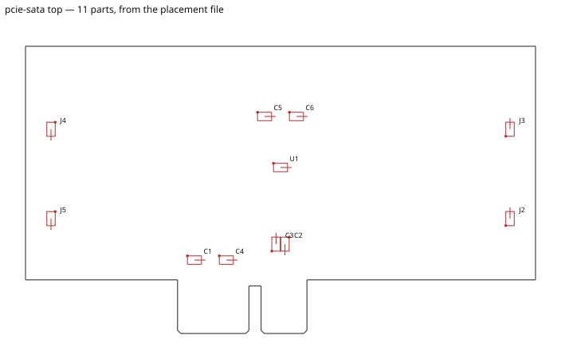

# M21 — assembly outputs: BOM and pick-and-place

The fab round wanted two files an assembler accepts. They exist now, in three
formats, with the research behind each column recorded in
[ADR 0015](../decisions/0015-assembly-outputs.md) and a placement overlay to check
them against.

**And the milestone's own acceptance criterion is not met, for a reason that is not
about the tooling.** `examples/pcie-sata` cannot produce a package with zero
missing-part-number warnings, because seven of its eleven placed parts have no
manufacturer part number and one of them cannot be given one: the SATA controller is
a stand-in with an invented pinout. §6 is that finding in full, and it is the part of
this report worth reading first if the next session is the order.

Measured on 2026-08-24, KiCad 9.0.8, on the development machine.

---

## The scoreboard

| | Asked for | Delivered |
|---|---|---|
| **research** | current JLCPCB and PCBWay requirements, in an ADR with sources | [ADR 0015](../decisions/0015-assembly-outputs.md) §2, both fabs, fetched from their own documentation |
| **M21a** procurement fields | `mpn`, `manufacturer`, `supplier_refs`, `assembly`, backward compatible | done; `assembly` **measured rather than defaulted**, and a fourth value added — §2 |
| **M21b** BOM export | `--bom [--format …]`, grouped, deterministic | done, three formats |
| **M21c** CPL export | `--cpl [--format …]`, rotation mapped, overlay, back-side guard | done; **no rotation-correction table ships, deliberately** — §4 |
| **M21d** the bundle | `--assembly`, zipped, committed acceptance artifact | done; artifact at `tests/golden/pcie-sata/assembly/`, checklist in §5 |
| **acceptance** | pcie-sata exports with zero missing-mpn warnings | **not met** — seven parts block it, §6 |

---

## 1. The audit: what already existed, and why none of it was an assembly file

M21's brief carried a correction — `aipcb export` advertises "a BOM and a placement
file", so this might be hardening rather than building. It was worth checking and the
answer was no. What shipped before M21:

* **`bom.csv`**, from `kicad-cli sch export bom`, columns
  `Reference,Value,Footprint,QUANTITY,Description`. No part number, no manufacturer,
  no fab id — because none of those was ever written into the schematic. The
  `Supplier` model has carried `manufacturer` and `mpn` since the beginning and
  **only `datasheet` was ever emitted anywhere**; the other two were dead fields.
* **`pcie-sata-all-pos.csv`**, from `kicad-cli pcb export pos`, columns
  `Ref,Val,Package,PosX,PosY,Rot,Side`, sides spelled `top`/`bottom`, rotations
  signed.
* Designators compressed to ranges (`J2-J5`) by KiCad's grouping — and neither fab
  documents range notation, while JLCPCB matches designators between the two files
  literally.

Both files are correct KiCad output. Neither is a file an assembler takes. They are
kept exactly as they were — byte-identical, still in the fabrication package — and
the assembly files are additive and off unless asked for.

The full gap table is [ADR 0015](../decisions/0015-assembly-outputs.md) §1.

---

## 2. M21a — the schema, and the one place the brief was not followed

`mpn`, `manufacturer` and `supplier_refs` are as specified. `assembly` is where this
deviates, and it is worth stating plainly because it was a deliberate refusal of the
brief's default.

> **Brief:** `assembly: smt | tht | dnp | none` (default smt)
> **Built:** the same four values, plus a fifth state — *unset* — which is
> **measured off the footprint** rather than defaulted.

The reason is a measurement on this repository's own corpus. Four bundled examples
are built around through-hole parts: the breakout headers in `congestion`, the DIP-8
in `mcu-4layer` whose two rows of pins are the obstacle that board exists to route
around, the pin headers in `backplane`, the power header in `ldo-supply`. PCBWay's
centroid file is documented as **surface-mount only**. A default of `smt` would have
put every one of those into a file that must not contain them, and it would have done
it silently, in exactly the file whose job is to be checked.

So an undeclared `assembly` is read off the footprint KiCad actually placed — its
`(attr …)` flags, then its pad types — and a declaration always wins. Verified live:

```
mcu-4layer, generic BOM        →  J2 (PinHeader_1x06)  tht
                                  U1 (DIP-8_W7.62mm)   tht
mcu-4layer, PCBWay centroid    →  J2, U1 absent; C1-C3, J1, R1-R3, U2 present
```

**A fourth value the brief did not have, which the corpus needed: `none`.** A
card-edge finger field and a mounting hole are on the board, are on a net, and are
neither bought nor placed. Before it existed, `examples/pcie-sata`'s gold fingers
appeared on the bill of materials as a line no assembler could source, and
`examples/enclosure`'s two M3 holes with them. `PCIE_X1_EDGE` and `MOUNT_M3_PAD` now
declare `assembly: none` and are absent from both files.

**Backward compatibility** is not asserted, it is exercised: `supplier: {mpn: …}`
predates this milestone and `ATTINY85_DIP8` and `AMS1117_3V3` still use it.
`Part.procurement()` folds the two spellings, declaring both with different values is
an error, and `mcu-4layer` exports with those two part numbers filled in from the old
spelling. Every one of the twelve examples exports.

---

## 3. M21b and M21c — the files

`aipcb export --bom --cpl --assembly --format jlcpcb|pcbway|generic` (repeatable).
Columns and per-fab rules come from each fab's published requirements; sources in
ADR 0015 §2. Three rules are worth repeating here because they are decisions rather
than transcription:

* **PCBWay's centroid holds surface-mount parts only** — their words. A format is
  therefore not a rename, it carries rules.
* **Designators are listed, never ranged.** `J2,J3,J4,J5`, not `J2-J5`.
* **DNP is said in words**, in the BOM's `Comment` column, because neither fab
  documents a machine-readable way to say it, and the part never reaches the
  centroid. A silent DNP is a fitted part.
* **JLCPCB's documented limits are checked too**, not only its column names: a BOM
  line carrying more than 200 designators is a rejected upload, so it warns and
  names the line. No bundled example reaches it — `backplane`'s sixteen terminator
  resistors are the longest line in the corpus.

**The coordinates are not computed twice.** The centroid is a transcription of the
placement CSV `kicad-cli` already writes for the Gerber package, which is exported
with the same `--use-drill-file-origin`. Measured on `pcie-sata`: `aux_axis_origin`
`(100, 145)`, `U1` at `(140, 119)` in KiCad's frame, `(40, 26)` in the file — origin
subtracted, Y inverted. A test asserts every centroid coordinate equals the placement
file's, so the assembler's file and the fabricator's are one measurement rather than
two that agree today.

**The bill is driven by the netlist, not by the placement file** — a bug found while
building, and worth recording. Deriving the BOM from placement rows meant that any
footprint KiCad excludes from position files silently vanished from the order. That
is right for a card edge and catastrophic for a battery holder, and only the design
knows which is which. Parts with no placement row are now on the bill and off the
centroid.

---

## 4. Rotation — the convention is implemented, the correction is not

This is the trap the brief named, and the answer is narrower than "implement the
mapping".

**The convention needs no transform.** Both fabs document degrees, counter-clockwise
positive. JLCPCB: *"The rotation of the component given in degrees. Positive values
are counter clockwise."* KiCad writes degrees, counter-clockwise positive. The only
difference is range — KiCad signs them, the fabs' samples run 0–360 — so the value is
folded into `[0, 360)`. **No part turns.** `-90` becomes `270`, which is the same
orientation said differently, and eight parametrised cases pin it.

**The correction is a different thing and no table ships.** What breaks boards is not
the convention but the zero reference: a fab whose parts library holds a package at a
different orientation from the KiCad footprint needs a per-package offset. Three
things were established about it:

1. **Neither fab publishes it.** JLCPCB documents the convention and not the offsets.
   There is no authoritative table to verify against — and M21's guardrail says the
   mapping must be verified against the fab's documented convention rather than
   inferred.
2. **It is not algorithmic.** The community tooling that solves this — KiBot's
   `rot_footprint`, `kicad-jlcpcb-tools`' rotation database — is a hand-maintained
   lookup of regular expressions over footprint names.
3. **It is not even a function of the footprint.** KiBot's own documentation:
   *"you can have two components with the same footprint and different rotations in
   the same project."*

A table keyed by footprint is a heuristic by construction, and a wrong offset looks
exactly like a right one until the board comes back. Copying one out of a GPL project
would also be the same act as copying its code.

**So the verification is a picture.** `--assembly` renders a placement overlay per
populated side, drawn from the centroid file's own rows — not from the board, because
the board is not what gets sent. Every part where the file puts it, turned the way the
file turns it, with a dot marking where pin one lands after that rotation, and the
bottom side mirrored as it is inspected in the real world.



---

## 5. M21d — the acceptance artifact, and the checklist against it

`tests/golden/pcie-sata/assembly/` holds the package: the JLCPCB BOM and centroid,
the complete generic pair, and the top-side overlay. `python -m tests.regenerate_golden`
rewrites it and a test compares against it, so a change to a column, a part or a
rotation shows up as a diff — the diff an assembler would have received.

**The manual review, once, line by line:**

| Check | Result |
|---|---|
| every placed part has a part number | **no** — 7 of 11: `C1, C2, C3, C4, C5, C6, U1`. §6 |
| designators on the centroid all appear on the bill | yes — JLCPCB rejects a mismatch, and a test asserts the containment |
| designator case consistent between the files | yes — one source, one spelling |
| units millimetres, `Layer` = `Top`/`Bottom` | yes |
| rotations within [0, 360) | yes — `0`, `90`, `270` only on this board |
| rotations eyeballed against the overlay | yes — `J2`/`J3` on the east edge at 90°, `J4`/`J5` on the west at 270°, facing inward; `C2`/`C3` at 270°/90° either side of the transmit pair; `U1` at 0°. All agree with the routed board plot |
| non-components off both files | yes — `J1`, the card-edge finger field, appears on neither |
| DNP handling | **not exercised by this board** — it has no DNP parts. Unit tests cover it, and §5.1 exercises it end to end on a derived design |
| polarity | **not exercised by this board** — every part on it is non-polarised, so the overlay's main value, catching a backwards diode, is untested against a real design |
| byte-stable across runs | yes — asserted by a test over every file in the package |

Two entries in that table are honest gaps rather than passes, and they are why the
overlay is documented as the thing to look at rather than a formality: the first
design with a diode or an electrolytic is the one that tests it.

### 5.1 DNP, exercised on a real design rather than only in fixtures

No bundled example marks a part do-not-populate, so the acceptance clause "DNP flows
correctly through both files" was checked against a copy of `ldo-supply` with
`dnp: true` added to `J2` — one of its two identical 2-pin power headers, chosen
because it makes the harder claim as well as the easy one:

```
BOM   PWR_IN,J1,Connector_PinHeader_2.54mm:PinHeader_1x02_P2.54mm_Vertical,
      PWR_IN (DNP - DO NOT POPULATE),J2,Connector_PinHeader_2.54mm:PinHeader_1x02_P2.54mm_Vertical,
CPL   C1 C2 C3 C4 J1 U1                     ← J2 absent
```

`J2` is marked on the bill and off the centroid, which is the clause. **And `J1` and
`J2` did not merge**, though they are the same part with the same footprint and the
same value — which is the defect a unit test caught while this was being built: with
the part number alone as the grouping key, a do-not-populate instance and a fitted
one became one line, and that line was marked whichever it met first. Half the
board's headers would have been fitted or not according to alphabetical order.

---

## 6. What would block a real order

**Seven of eleven placed parts on `examples/pcie-sata` have no manufacturer part
number.** The tool names them rather than failing silently:

```
warning[assembly-missing-mpn]: 7 placed parts have no manufacturer part number:
  C1, C2, C3, C4, C5, C6, U1
```

They divide into two cases and only one of them is data entry.

**The six capacitors are a procurement decision nobody has made.** The library
specifies each of them completely enough to buy — "100 nF X7R ceramic capacitor,
0603, 50 V" — but choosing *which manufacturer's* 100 nF, and which LCSC code, is a
decision with a stock level and a price attached. This milestone did not make it up.
An invented LCSC code is not a missing part, it is **the wrong component soldered to
the board**, and that failure is silent until the board does not work. The one part
number added here, JST's `SM07B-GHS-TB` on the SATA connectors, was added because
KiCad's own footprint is a binding to exactly that part — the part number is in the
footprint's name — and not because it was looked up.

**`U1` cannot be given a part number at all, and this is the finding.**
`examples/library/highspeed.yaml` says so in its own header, and the audit for this
milestone is what made it matter:

* the symbol is a **borrowed 49-pin generic connector**, chosen because KiCad ships
  no symbol for an ASM1064-class bridge;
* the **pinout is this board's own invention** — the signal assignments are plausible
  and they are not any real part's;
* the **power architecture is explicitly scenery**: the library says a real bridge of
  this function has a core rail, separate analog and PLL supplies and an I/O supply,
  and carries 15–25 capacitors. This board declares two supply pins on one 3.3 V rail
  and carries six.

So there is no manufacturer part whose pins are wired the way this design wires them.
A part number written there would be a number an assembler could order and a
component that could not work — and, worse, a board that assembles cleanly and is
dead.

**What this means for the fab round, stated plainly.** M21's premise was that the
assembly files were the last tooling blocker before ordering `pcie-sata` assembled.
The tooling blocker is gone. **The blocker that remains is the design**: `pcie-sata`
is a routing demonstration with a stand-in controller, and it is not a board that can
be populated and work, whatever files are generated for it. That is a decision for
the owner and not something this milestone should have quietly resolved by inventing
data. Three ways forward, in the order they seem sensible:

1. **Order it bare.** Every fabrication file has been correct since M10 and the
   assembly files are not needed. The board demonstrates routing, impedance and
   pours, and none of that requires it to be populated.
2. **Give the flagship a real controller** — a real MPN, its real pinout, its real
   power tree — which is a design milestone with a schematic review in it, and would
   also give the SI work a part whose reference design exists.
3. **Assemble a different board.** `ldo-supply` and `mcu-4layer` are made of real,
   orderable parts and need only their part numbers filled in; both already carry
   two.

---

## 7. What is not built

* **Supplier API integration** — out of scope by the brief, and §6 is the argument
  for putting it on the roadmap: the thing that blocks an order is a part number
  nobody has looked up, and looking one up is exactly what an API does.
* **Panelization** — still fab-level, still out.
* **Two-sided assembly** — refused rather than approximated. `side: back` validates,
  warns and places on the front (M9), so an assembly export on a board with a
  back-side part errors with `assembly-back-side-unsupported` and names the parts.
  The guard stays until `side: back` is implemented.
* **Any router or placement work.** None was touched; every board hash is unchanged.
